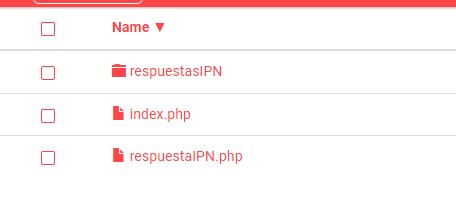

# Redirect-PaymentForm-IpnT1-PHP

Este es un ejemplo de una una implementación IPN(Instant Notification Payment) en PHP que estará recibiendo la información del pago y estará creando un archivo en la carpeta `respuestaIPN/` por cada notificación recibida. 


* Realizar una compra de prueba [Formulario de pago](). Ejemplo de código aquí.
* Verificar respuesta de pago por la IPN [Notificación de pago](https://app-izipay.000webhostapp.com/ipn/)

## Requisitos Previos

1.- Servidor web  
2.- PHP 7.0 o superior

## 1.- Descargar
Descargar el proyecto .zip haciendo click [Aquí](https://github.com/izipay-pe/Redirect-PaymentForm-IpnT1-PHP/archive/refs/heads/main.zip) o clonarlo con git.  
```sh
git clone https://github.com/izipay-pe/Redirect-PaymentForm-IpnT1-PHP.git
``` 

## 2.- Subirlo al servidor web.
Para este ejemplo se utilizó el servidor gratuito de 000webhost que trae por defecto PHP en sus versiones recientes.  
Nos dirigimos al administrador de archivos e ingresamos al botón "Subir archivos".  
Abrimos la capeta `public_html/` y copiamos todo el contenido del proyecto.



## 3.- Configurar la URL de notificación al final del pago
Ingresar a su back office vendedor [aquí](https://secure.micuentaweb.pe/vads-merchant/) e ingresar a `Configuración - Reglas de notificaciones / Url de notificación al final del pago`.


## 4.- Abrir el navegador con la ruta del proyecto
Abrir el navegador de chrome, mozilla, safari, etc, la ruta de su servidor web donde subió el proyecto.  
En la imagen de ejemplo tenemos dos notificaciones recibidas.


## 5.- Modificar Script IPN
Modificar el script `respuestaIPN.php` de acuerdo a sus necesitados y comprobar la firma IPN (hash), más iformación [aquí.](https://secure.micuentaweb.pe/doc/es-PE/rest/V4.0/api/kb/ipn_usage.html)   


