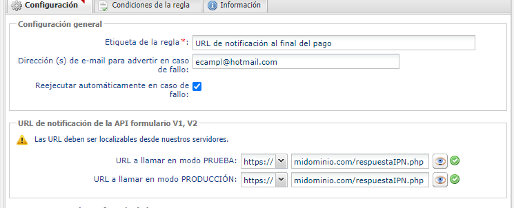
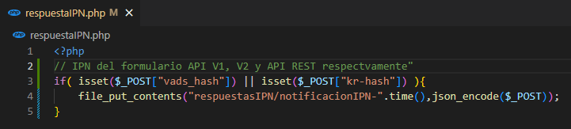
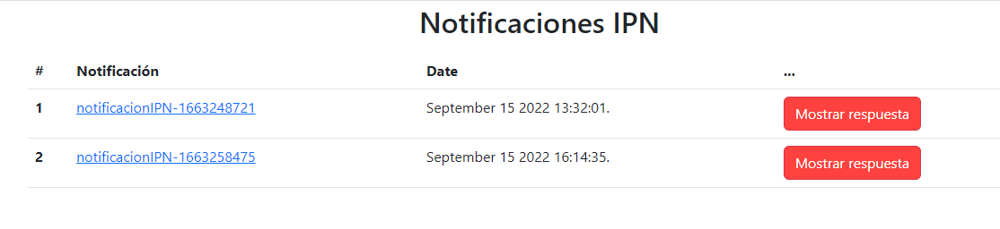

# Response-PaymentForm-IpnT1-PHP

Este es un ejemplo de una una implementación IPN(Instant Notification Payment) en PHP que estará recibiendo la información del pago y estará creando un archivo en la carpeta `respuestaIPN/` por cada notificación recibida. 

<!-- * Realizar una compra de prueba [Formulario de pago](). Ejemplo de código aquí. -->
<!-- * Verificar respuesta de pago por la IPN [Notificación de pago](https://app-izipay.000webhostapp.com/ipn/) -->

## Requisitos Previos

1.- Servidor web  
2.- PHP 7.0 o superior

## 1.- Crear el proyecto
Descargar el proyecto .zip haciendo click [Aquí](https://github.com/izipay-pe/Redirect-PaymentForm-IpnT1-PHP/archive/refs/heads/main.zip) o clonarlo con git.  
```sh
git clone https://github.com/izipay-pe/Redirect-PaymentForm-IpnT1-PHP.git
``` 

* **Paso1:** Mover el proyecto y descomprimirlo en la carpeta htdocs en la ruta de instalación de Xampp: C:\xampp\htdocs

    

* **Paso 2:** Abrir la aplicación XAMPP Control Panel ejecutar el botón Start del modulo de Apache, quedando de la siguiente manera:

    

* **Paso 3:** Abrir el navegador web(Chrome, Mozilla, Safari, etc) con el puerto 80 que abrió xampp : http://localhost:80/Response-PaymentForm-IpnT1-PHP

## 2.- Subirlo al servidor web.
Para este ejemplo se utilizó el servidor gratuito de 000webhost, ingrese a su cuenta de 000webhost y siga los siguientes pasos.

* **Paso 1:** Crearse un nuevo sitio.

    

* **Paso 2:** Crear una URL pública y generar una contraseña de acceso a su sitio

    

* **Paso 3:** Seleccionar File Manager para subir el proyecto.

    

* **Paso 4:** Seleccionar la carpeta public_html y copiar la carpeta con todos los archivos del proyecto .zip
```sh
respuestaIPN/
index.php
respuestaIPN.php
```
    

Ver el resultado en: https://tusitio.000webhostapp.com

## 3.- Configurar la URL de notificación al final del pago
Ingresar a su back office vendedor [aquí](https://secure.micuentaweb.pe/vads-merchant/) e ingresar a `Configuración - Reglas de notificaciones / Url de notificación al final del pago`.



## 4.- Modificar Script IPN
Modificar el script `respuestaIPN.php` de acuerdo a sus necesitados y comprobar la firma IPN (hash), más iformación [aquí.](https://secure.micuentaweb.pe/doc/es-PE/rest/V4.0/api/kb/ipn_usage.html)   



## 5.- Ejemplo del proyecto IPN




